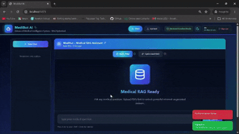
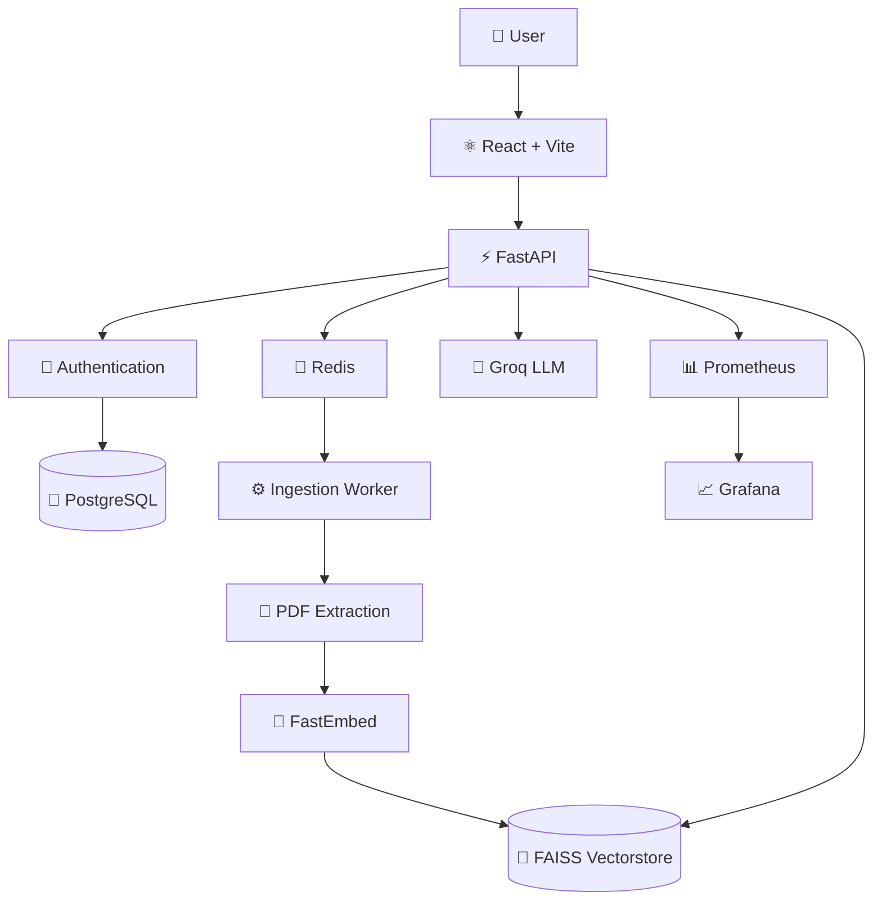

---
Medical Chatbot: AI-powered medical document intelligence with grounded RAG.
---

<div align="center">

#  Medibot

### Medical intelligence, grounded in your documents.

**Upload medical PDFs. Ask questions. Get answers grounded in the source material.**

<br/>

[](https://www.python.org/)
[](https://fastapi.tiangolo.com/)
[](https://react.dev/)
[](https://github.com/facebookresearch/faiss)
[](https://www.docker.com/)
[](https://kubernetes.io/)
[](https://groq.com/)
[](#-license)

<br/>

**FastAPI · React · LangChain · FAISS · FastEmbed · Groq · Redis/RQ · PostgreSQL · Docker · Kubernetes · AWS EKS**

</div>

---

## 🎬 See Medibot in Action

<p align="center">
  
</p>

<br/>

</div>

---

# 🩺 What is Medibot?

**Medibot** is a full-stack medical document intelligence platform built around **Retrieval-Augmented Generation (RAG)**.

Instead of relying only on an LLM's internal knowledge, Medibot lets users upload their own medical documents and interact with them through a conversational interface.

The system transforms:

```text
PDF
 │
 ▼
Text Extraction
 │
 ▼
Document Chunking
 │
 ▼
Embeddings
 │
 ▼
FAISS Vector Index
 │
 ▼
Semantic Retrieval
 │
 ▼
Groq LLM
 │
 ▼
Grounded Response
 │
 ▼
Source References
```

The result is a conversational experience where answers are generated using **retrieved information from the user's documents** rather than treating the LLM as the sole source of knowledge.

---

# ✨ Why Medibot?

Medibot is designed around a simple idea:

> **Medical documents should be searchable, conversational, and verifiable.**

### 📄 Bring Your Own Knowledge

Upload medical PDFs and create a searchable knowledge base from your own documents.

### 🔎 Retrieval Before Generation

Questions are answered using relevant retrieved document chunks before the LLM generates a response.

### 📚 Source-Aware Responses

Relevant document and page information can be surfaced alongside generated answers, making the response easier to inspect.

### ⚡ Asynchronous Processing

PDF extraction, embedding, and FAISS indexing run through background workers rather than blocking the main API.

### 💬 Conversational Experience

Continue conversations naturally with persistent chat history for authenticated users.

### 🚀 Production-Oriented Architecture

The system is designed with independent API nodes, background workers, Redis queues, persistent storage, monitoring, containerization, and Kubernetes deployment in mind.

---

# 🚀 Features

<table>
<tr>
<td width="50%">

## 📚 Document RAG

Upload medical PDFs and transform them into a semantic knowledge base.

</td>
<td width="50%">

## 🔎 Semantic Search

FAISS retrieves relevant chunks based on vector similarity.

</td>
</tr>

<tr>
<td>

## ⚙️ Async Ingestion

Redis/RQ workers handle document processing outside the API request path.

</td>
<td>

## 🤖 Groq Generation

Retrieved context is passed to a Groq-hosted LLM for fast response generation.

</td>
</tr>

<tr>
<td>

## 📖 Page References

Retrieved sources can be connected back to their originating documents and pages.

</td>
<td>

## 💬 Chat History

Authenticated users can persist and continue previous conversations.

</td>
</tr>

<tr>
<td>

## 🔐 Authentication

Email/password authentication with optional Google Sign-In.

</td>
<td>

## 📊 Observability

Prometheus metrics and Grafana dashboards provide operational visibility.

</td>
</tr>

<tr>
<td>

## 🐳 Docker

Run the complete application locally using Docker or Docker Compose.

</td>
<td>

## ☸️ Kubernetes

Deploy independently scalable API, worker, Redis, frontend, and monitoring services.

</td>
</tr>
</table>

---

# 🧠 RAG Pipeline

## 01 — Upload

The user uploads a medical PDF through the React frontend.

```text
User
 │
 ▼
React
 │
 ▼
FastAPI
```

The API creates an ingestion job instead of performing the complete indexing operation synchronously.

---

## 02 — Queue

The ingestion job is dispatched through Redis/RQ.

```text
FastAPI
   │
   ▼
Redis Queue
   │
   ▼
Ingestion Worker
```

This keeps document processing separate from normal chat traffic.

---

## 03 — Extract

The worker extracts text from the uploaded document.

```text
PDF
 │
 ▼
Text Extraction
 │
 ▼
Document Chunks
```

---

## 04 — Embed

Each chunk is transformed into an embedding using FastEmbed.

Default model:

```text
BAAI/bge-small-en-v1.5
```

```text
Document Chunk
      │
      ▼
   FastEmbed
      │
      ▼
Embedding Vector
```

---

## 05 — Index

Embeddings are stored in a FAISS vector index.

```text
Embedding Vectors
       │
       ▼
      FAISS
       │
       ▼
Searchable Knowledge Base
```

---

## 06 — Retrieve

When a user asks a question, the query is embedded and compared against the vector index.

```text
User Question
      │
      ▼
Query Embedding
      │
      ▼
FAISS Similarity Search
      │
      ▼
Relevant Chunks
```

---

## 07 — Generate

The retrieved context is provided to the Groq-powered LLM.

```text
                  ┌──────────────────┐
                  │   User Question  │
                  └────────┬─────────┘
                           │
                           +
                           │
                  ┌────────▼─────────┐
                  │ Retrieved Context│
                  └────────┬─────────┘
                           │
                           ▼
                     ┌───────────┐
                     │  Groq LLM │
                     └─────┬─────┘
                           │
                           ▼
                    Grounded Answer
```

---

## 08 — Respond

The response is streamed back to the frontend.

```text
┌──────────────────────────────────┐
│          AI RESPONSE             │
│                                  │
│  Generated using retrieved       │
│  medical document context.       │
│                                  │
│  Sources                          │
│  ──────────────────────────────  │
│  📄 Document — Page X            │
│  📄 Document — Page Y            │
└──────────────────────────────────┘
```

---

# 🏗️ Architecture



---

# ⚡ A Key Design Decision

The ingestion pipeline is intentionally **decoupled from the chat API**.

A simpler implementation could process everything inside the upload request:

```text
Upload
  │
  ▼
Extract
  │
  ▼
Embed
  │
  ▼
Build FAISS
  │
  ▼
Return
```

This can become problematic when processing large documents.

Medibot instead uses:

```text
                    PDF Upload
                        │
                        ▼
                  ┌───────────┐
                  │  FastAPI  │
                  └─────┬─────┘
                        │
                        ▼
                  ┌───────────┐
                  │   Redis   │
                  │   Queue   │
                  └─────┬─────┘
                        │
                        ▼
                ┌───────────────┐
                │ Ingest Worker │
                └───────┬───────┘
                        │
                        ▼
              PDF → Embed → FAISS
```

This allows the system to scale **chat traffic and document processing independently**.

---

# 🧩 Technology Stack

| Layer           | Technology               | Purpose                            |
| --------------- | ------------------------ | ---------------------------------- |
| Frontend        | React + Vite             | Web application                    |
| API             | FastAPI                  | Backend API                        |
| RAG             | LangChain                | Retrieval/generation orchestration |
| Vector Search   | FAISS                    | Semantic similarity search         |
| Embeddings      | FastEmbed                | Local embedding generation         |
| Embedding Model | `BAAI/bge-small-en-v1.5` | Text embeddings                    |
| LLM             | Groq                     | Response generation                |
| Queue           | Redis                    | Job dispatch                       |
| Workers         | RQ                       | Background ingestion               |
| Database        | PostgreSQL               | Production accounts/history        |
| Local Database  | SQLite                   | Development fallback               |
| Containers      | Docker                   | Application packaging              |
| Orchestration   | Kubernetes               | Production deployment              |
| Monitoring      | Prometheus               | Metrics                            |
| Dashboards      | Grafana                  | Observability                      |
| CI/CD           | GitLab CI/CD             | Build and deployment               |
| Cloud           | AWS EKS                  | Production Kubernetes              |

---

# 📁 Project Structure

```text
medical-chatbot/
│
├── backend/
│   ├── main.py
│   ├── ingest_worker.py
│   ├── job_store.py
│   └── ...
│
├── frontend/
│   ├── src/
│   ├── public/
│   └── ...
│
├── docker/
│   ├── backend.Dockerfile
│   └── frontend.Dockerfile
│
├── k8s/
│   ├── backend/
│   ├── frontend/
│   ├── ingress/
│   ├── hpa/
│   ├── monitoring/
│   └── overlays/
│
├── testing/
│   ├── tests/
│   ├── reports/
│   └── evaluations/
│
├── ops/
│   └── production-guide.md
│
├── docker-compose.yml
├── docker-compose.ports.override.yml
├── Dockerfile
├── render.yaml
├── .gitlab-ci.yml
├── pitch.mp4
├── pitch_samples.png
└── README.md
```

---

# ⚡ Quick Start

## Prerequisites

You will need:

* Python **3.11 or 3.12**
* Node.js
* Docker
* Groq API key

---

## 1. Clone

```bash
git clone <your-repository-url>
cd medical-chatbot
```

---

## 2. Configure the backend

Create:

```text
backend/.env
```

Minimum configuration:

```env
GROQ_API_KEYS=your_groq_api_key
```

For production authentication:

```env
AUTH_SECRET=your_secure_secret
AUTH_DATABASE_URL=postgresql://...
GOOGLE_CLIENT_ID=your_google_client_id
GROQ_API_KEYS=key1,key2
```

> 🔒 Never commit `.env` files or real credentials.

---

## 3. Install backend dependencies

Create a virtual environment:

```bash
python -m venv .venv
```

### Windows

```bash
.venv\Scripts\activate
```

### Linux / macOS

```bash
source .venv/bin/activate
```

Install:

```bash
pip install -r backend/requirements.txt
```

---

## 4. Install frontend dependencies

```bash
cd frontend
npm install
npm run build
cd ..
```

---

## 5. Start the API

```bash
uvicorn backend.main:app \
  --host 0.0.0.0 \
  --port 8000
```

Open:

| Service        | URL                                |
| -------------- | ---------------------------------- |
| 🩺 Application | `http://localhost:8000/`           |
| ❤️ Health      | `http://localhost:8000/api/health` |
| 📊 Metrics     | `http://localhost:8000/metrics`    |

---

# 🐳 Docker

Build the application:

```bash
docker build -t medical-chatbot .
```

Run:

```bash
docker run \
  --env-file backend/.env \
  -p 8000:8000 \
  medical-chatbot
```

---

# 🐳 Full Local Stack

For the complete multi-service environment:

```bash
docker compose up --build
```

This starts:

```text
                         ┌──────────────┐
                         │   Frontend   │
                         │    :8080     │
                         └──────┬───────┘
                                │
                                ▼
                         ┌──────────────┐
                         │   Gateway    │
                         │    :8000     │
                         └──────┬───────┘
                                │
                ┌───────────────┼───────────────┐
                │               │               │
                ▼               ▼               ▼
           Backend 1       Backend 2       Backend 3
                │               │               │
                └───────────────┼───────────────┘
                                │
                                ▼
                         ┌──────────────┐
                         │    Redis     │
                         └──────┬───────┘
                                │
                                ▼
                       ┌────────────────┐
                       │ Ingest Worker  │
                       └───────┬────────┘
                               │
                               ▼
                         ┌────────────┐
                         │   FAISS    │
                         └────────────┘
```

### Services

| Service         |     Port | Purpose        |
| --------------- | -------: | -------------- |
| Backend gateway |   `8000` | API            |
| Frontend        |   `8080` | Web UI         |
| Prometheus      |   `9090` | Metrics        |
| Grafana         |   `3000` | Monitoring     |
| Redis           | Internal | Job queue      |
| Ingest worker   | Internal | PDF processing |

### Grafana

Default local credentials:

```text
Username: admin
Password: admin
```

Change these before exposing Grafana externally.

---

# 🔀 Alternate Ports

If port `8000` is already occupied:

```bash
docker compose \
  -f docker-compose.yml \
  -f docker-compose.ports.override.yml \
  up --build
```

This exposes:

```text
Backend   → http://localhost:8010
Frontend  → http://localhost:8081
```

Telemetry ports can be overridden with:

```env
PROMETHEUS_HOST_PORT=
GRAFANA_HOST_PORT=
```

---

# ⚙️ Ingestion Configuration

Recommended local indexing settings:

```env
EMBED_BATCH_SIZE=32
EMBED_THREADS=4
EMBED_PARALLEL=2
INGEST_MAX_WORKERS=8
```

For memory-constrained environments:

```env
EMBED_BATCH_SIZE=4
RAG_MAX_PDF_PAGES=80
```

---

# 🧪 Testing & Evaluation

Tests and generated reports are located under:

```text
testing/
```

Run the API test suite:

```bash
python -m unittest testing.tests.test_api
```

LLM evaluation reports are written to:

```text
testing/reports/evaluations/
```

The testing layer provides a foundation for:

* API regression testing
* ingestion verification
* RAG evaluation
* LLM response evaluation
* system verification

---

# 🔌 API Reference

## Health & Observability

| Method | Endpoint      | Description        |
| ------ | ------------- | ------------------ |
| `GET`  | `/api/health` | Application health |
| `GET`  | `/metrics`    | Prometheus metrics |

## Authentication

| Method | Endpoint             | Description                  |
| ------ | -------------------- | ---------------------------- |
| `GET`  | `/api/auth/config`   | Authentication configuration |
| `POST` | `/api/auth/register` | Register                     |
| `POST` | `/api/auth/login`    | Login                        |
| `POST` | `/api/auth/google`   | Google Sign-In               |
| `GET`  | `/api/auth/me`       | Current user                 |

## Chat

| Method | Endpoint            | Description           |
| ------ | ------------------- | --------------------- |
| `GET`  | `/api/chat-history` | Retrieve chat history |
| `PUT`  | `/api/chat-history` | Update chat history   |
| `POST` | `/api/ask`          | Ask a question        |
| `POST` | `/api/ask/stream`   | Stream an answer      |

## Documents

| Method   | Endpoint                      | Description              |
| -------- | ----------------------------- | ------------------------ |
| `POST`   | `/api/upload`                 | Upload PDF               |
| `GET`    | `/api/upload/status/{job_id}` | Check ingestion status   |
| `POST`   | `/api/upload/cancel/{job_id}` | Cancel ingestion         |
| `DELETE` | `/api/upload/{job_id}`        | Delete uploaded document |
| `GET`    | `/api/source/{doc_id}`        | Retrieve source document |

---

# 🔐 Authentication

Medibot supports email/password authentication locally and optionally Google Sign-In.

## Local Development

If `AUTH_DATABASE_URL` is not configured, the backend falls back to:

```text
backend/data/medibot_auth.sqlite3
```

## Production

Configure PostgreSQL:

```env
AUTH_DATABASE_URL=postgresql://...
```

Recommended:

```env
AUTH_SECRET=<strong-random-secret>
AUTH_DATABASE_URL=<postgresql-connection-string>
GOOGLE_CLIENT_ID=<google-client-id>
```

---

# 🧠 Model Configuration

## Embeddings

Default model:

```text
BAAI/bge-small-en-v1.5
```

Configure:

```env
EMBED_MODEL=BAAI/bge-small-en-v1.5
```

## Groq

Default model:

```env
GROQ_MODEL=llama-3.1-8b-instant
```

Multiple API keys are supported:

```env
GROQ_API_KEYS=key1,key2,key3
```

---

# 📊 Observability

Medibot includes Prometheus and Grafana:

```text
Application
     │
     ▼
 /metrics
     │
     ▼
Prometheus
     │
     ▼
 Grafana
```

This provides a foundation for monitoring:

* API behavior
* ingestion workloads
* application performance
* system health
* operational regressions
* capacity

---

# ☸️ Kubernetes

The Kubernetes deployment separates the major components:

```text
Frontend
Backend API
Ingestion Workers
Redis
Prometheus
Grafana
Ingress
Autoscaling
```

Deploy:

```bash
kubectl apply -k k8s
```

---

## Local Kubernetes

Build the backend:

```bash
docker build \
  -f docker/backend.Dockerfile \
  -t medical-chatbot-backend:local .
```

Build the frontend:

```bash
docker build \
  -f docker/frontend.Dockerfile \
  -t medical-chatbot-frontend:local .
```

Deploy:

```bash
kubectl apply -k k8s/overlays/local
```

### Port forwarding

```bash
kubectl -n medical-chatbot \
  port-forward svc/frontend 8080:80
```

```bash
kubectl -n medical-chatbot \
  port-forward svc/backend 8000:8000
```

```bash
kubectl -n medical-chatbot \
  port-forward svc/prometheus 9090:9090
```

```bash
kubectl -n medical-chatbot \
  port-forward svc/grafana 3000:3000
```

---

# ☁️ AWS EKS

The production Kubernetes architecture is designed to support AWS EKS.

For shared uploaded PDFs and FAISS indexes, `ReadWriteMany` PVCs should use **EFS or another appropriate RWX-compatible storage class**.

```text
                       AWS EKS
                          │
          ┌───────────────┼───────────────┐
          │               │               │
          ▼               ▼               ▼
      Frontend         Backend          Workers
                          │               │
                          ▼               ▼
                        Redis       Shared Storage
                                          │
                                          ▼
                                        FAISS
```

Optional Prometheus Operator resources are available at:

```text
k8s/overlays/operator-monitoring
```

---

# 🔁 GitLab CI/CD

The repository includes a GitLab-first CI/CD pipeline.

```text
Git Push
   │
   ▼
Test / Compile
   │
   ▼
Frontend Build
   │
   ▼
Docker Build
   │
   ▼
GitLab Container Registry
   │
   ▼
Manual Deployment
   │
   ▼
AWS EKS
```

### Pipeline

1. Install backend dependencies
2. Run `python -m compileall backend`
3. Install frontend dependencies
4. Run `npm run build`
5. Build backend image
6. Build frontend image
7. Push both images
8. Optionally deploy to EKS

### Required GitLab variables

```text
AWS_ACCESS_KEY_ID
AWS_SECRET_ACCESS_KEY
AWS_REGION
EKS_CLUSTER_NAME
GROQ_API_KEYS
```

GitLab provides:

```text
CI_REGISTRY
CI_REGISTRY_USER
CI_REGISTRY_PASSWORD
CI_REGISTRY_IMAGE
```

The deployment job creates or updates:

```text
gitlab-registry
medical-chatbot-secrets
```

and applies:

```bash
kubectl apply -k k8s
```

---

# 🤗 Hugging Face Spaces

Medibot is configured to run as a Docker Space.

## Setup

1. Create a new Hugging Face Space.
2. Select **Docker**.
3. Upload or connect this repository.
4. Add the secret:

```text
GROQ_API_KEYS
```

5. Push the repository.
6. Wait for the Space to build.

The application is exposed on port:

```text
8000
```

### ⚠️ Free-tier storage

The free CPU environment uses ephemeral storage.

Uploaded PDFs, embedding caches, and FAISS indexes may be lost after restarts or rebuilds.

Hugging Face Spaces is therefore best suited for:

```text
Demos · Prototypes · Experiments · Evaluation
```

rather than persistent production document storage.

---

# 🚀 Render

The repository includes:

```text
render.yaml
```

and can be deployed as a Docker web service.

## Setup

1. Push the repository to your connected Git provider.
2. Create a Render Blueprint.
3. Point it to the repository.
4. Configure:

```text
GROQ_API_KEYS
```

5. Deploy.

Recommended values:

```env
DB_FAISS_BASE=/tmp/vectorstore
EMBED_MODEL=BAAI/bge-small-en-v1.5
EMBED_BATCH_SIZE=4
RAG_MAX_PDF_PAGES=80
GROQ_MODEL=llama-3.1-8b-instant
```

Health endpoint:

```text
/api/health
```

### Storage

Free Render instances may spin down when idle and use ephemeral storage.

For persistent storage on a paid instance:

```env
DB_FAISS_BASE=/data/vectorstore
```

---

# 🚂 Railway

Login:

```bash
npx @railway/cli login
```

Initialize:

```bash
npx @railway/cli init --name Medical_chatbot
```

Link the service:

```bash
npx @railway/cli service link backend
```

Deploy:

```bash
npx @railway/cli up --service backend
```

Configure:

```text
GROQ_API_KEYS
GROQ_MODEL
DB_FAISS_BASE
EMBED_MODEL
EMBED_BATCH_SIZE
RAG_MAX_PDF_PAGES
```

Recommended:

```env
GROQ_MODEL=llama-3.1-8b-instant
DB_FAISS_BASE=/data/vectorstore
EMBED_MODEL=BAAI/bge-small-en-v1.5
EMBED_BATCH_SIZE=4
RAG_MAX_PDF_PAGES=80
```

Add persistent storage:

```bash
npx @railway/cli volume add
```

Mount:

```text
/data
```

Set:

```bash
npx @railway/cli variable set \
  --service backend \
  --environment production \
  DB_FAISS_BASE=/data/vectorstore
```

Redeploy:

```bash
npx @railway/cli up --service backend
```

---

# 📦 Deployment Options

| Platform          | Best For            | Persistent Storage | Complexity |
| ----------------- | ------------------- | -----------------: | ---------: |
| 🐳 Docker         | Development         |                  ✅ |        Low |
| 🐳 Docker Compose | Full local stack    |                  ✅ |        Low |
| 🤗 Hugging Face   | Demo / prototype    |        ❌ Free tier |        Low |
| 🚀 Render         | Simple deployment   |  ⚠️ Plan dependent |        Low |
| 🚂 Railway        | Small production    |      ✅ With volume |        Low |
| ☸️ Kubernetes     | Production          |                  ✅ |       High |
| ☁️ AWS EKS        | Scalable production |                  ✅ |       High |

---

# 🔧 Environment Variables

```env
# ─────────────────────────────
# LLM
# ─────────────────────────────

GROQ_API_KEYS=
GROQ_MODEL=llama-3.1-8b-instant


# ─────────────────────────────
# Embeddings
# ─────────────────────────────

EMBED_MODEL=BAAI/bge-small-en-v1.5
EMBED_BATCH_SIZE=4
EMBED_THREADS=4
EMBED_PARALLEL=2


# ─────────────────────────────
# RAG
# ─────────────────────────────

DB_FAISS_BASE=/data/vectorstore
RAG_MAX_PDF_PAGES=80


# ─────────────────────────────
# Ingestion
# ─────────────────────────────

INGEST_MAX_WORKERS=8


# ─────────────────────────────
# Authentication
# ─────────────────────────────

AUTH_SECRET=
AUTH_DATABASE_URL=
GOOGLE_CLIENT_ID=


# ─────────────────────────────
# Observability
# ─────────────────────────────

PROMETHEUS_HOST_PORT=
GRAFANA_HOST_PORT=
```

---

# 🛠️ Troubleshooting

<details>
<summary><strong>❌ Render deployment fails because of large local files</strong></summary>

Ensure generated runtime directories are not committed:

```text
backend/data/
vectorstore/
```

Also ensure `.env` files are excluded from the Docker build context.

</details>

<details>
<summary><strong>❌ /app/health returns Not Found</strong></summary>

Use:

```text
/api/health
```

instead.

</details>

<details>
<summary><strong>❌ RAG not ready</strong></summary>

Check that:

1. At least one PDF has been uploaded.
2. Ingestion has completed.
3. The vectorstore exists.
4. `DB_FAISS_BASE` points to the correct location.

</details>

<details>
<summary><strong>❌ Frontend loads but is blank</strong></summary>

Check that static assets are being served from:

```text
/assets/
```

Then perform a hard refresh.

</details>

<details>
<summary><strong>❌ Railway runs out of memory during ingestion</strong></summary>

Reduce:

```env
EMBED_BATCH_SIZE=4
```

and:

```env
RAG_MAX_PDF_PAGES=80
```

Start with smaller PDFs on memory-constrained instances.

</details>

---

# 🔒 Security

Medical information requires careful handling.

Never commit:

```text
.env
API keys
Database passwords
Private credentials
Production secrets
```

If a credential is exposed:

1. Revoke it immediately.
2. Rotate the credential.
3. Update deployment secrets.
4. Review repository history if necessary.

For production environments, consider:

* HTTPS
* strong authentication secrets
* managed PostgreSQL
* secret management
* restricted Kubernetes permissions
* protected monitoring endpoints
* controlled document storage
* appropriate access controls
* audit logging

---

# 📈 Scaling Philosophy

Medibot separates **chat traffic** from **document ingestion**.

```text
                    MEDIBOT
                       │
          ┌────────────┴────────────┐
          │                         │
          ▼                         ▼
      CHAT PATH               INGESTION PATH
          │                         │
          ▼                         ▼
       FastAPI                    Redis
          │                         │
          ▼                         ▼
        Groq                  RQ Workers
                                    │
                                    ▼
                           PDF + Embeddings
                                    │
                                    ▼
                                  FAISS
```

This architecture allows:

```text
API replicas        → scale independently
Ingestion workers   → scale independently
Redis               → decouple workloads
Vector storage      → persist knowledge
Monitoring          → observe the system
```

---

# 🗺️ Roadmap

* [ ] Multi-document collections
* [ ] Document-level access control
* [ ] Advanced retrieval reranking
* [ ] Hybrid lexical + semantic search
* [ ] Improved citation verification
* [ ] Streaming retrieval events
* [ ] Document management interface
* [ ] RAG evaluation dashboards
* [ ] Automated RAG quality benchmarks
* [ ] Persistent object storage
* [ ] Advanced observability
* [ ] Fine-grained user permissions
* [ ] Production-grade secret management

---

# ⚠️ Medical Disclaimer

**Medibot is an AI-assisted medical information tool, not a medical professional or clinical decision-making system.**

AI-generated responses can contain errors, omissions, or inappropriate interpretations.

This project should not be used as a substitute for:

* professional medical advice
* diagnosis
* treatment decisions
* emergency medical care
* clinical judgment

Any real-world clinical deployment would require appropriate **clinical validation, privacy controls, security review, human oversight, evaluation, governance, and regulatory compliance**.

---

# 🤝 Contributing

Contributions, bug reports, evaluation improvements, and architecture suggestions are welcome.

Create a feature branch:

```bash
git checkout -b feature/my-improvement
```

Run backend tests:

```bash
python -m unittest testing.tests.test_api
```

Build the frontend:

```bash
cd frontend
npm run build
```

Then open a pull request.

---

# 📚 Production Documentation

For the complete production deployment and operations guide:

```text
ops/production-guide.md
```

It covers:

* CI/CD
* Kubernetes
* AWS EKS
* monitoring
* autoscaling
* SLA considerations
* security
* production operations

---

# 📄 License

Medibot is released under the **MIT License**.

See [`LICENSE`](LICENSE) for the complete license text.

```text
MIT License

Copyright (c) [year] [fullname]

Permission is hereby granted, free of charge, to any person obtaining a copy
of this software and associated documentation files (the "Software"), to deal
in the Software without restriction, including without limitation the rights
to use, copy, modify, merge, publish, distribute, sublicense, and/or sell
copies of the Software, and to permit persons to whom the Software is
furnished to do so, subject to the following conditions:

The above copyright notice and this permission notice shall be included in all
copies or substantial portions of the Software.

THE SOFTWARE IS PROVIDED "AS IS", WITHOUT WARRANTY OF ANY KIND, EXPRESS OR
IMPLIED, INCLUDING BUT NOT LIMITED TO THE WARRANTIES OF MERCHANTABILITY,
FITNESS FOR A PARTICULAR PURPOSE AND NONINFRINGEMENT. IN NO EVENT SHALL THE
AUTHORS OR COPYRIGHT HOLDERS BE LIABLE FOR ANY CLAIM, DAMAGES OR OTHER
LIABILITY, WHETHER IN AN ACTION OF CONTRACT, TORT OR OTHERWISE, ARISING FROM,
OUT OF OR IN CONNECTION WITH THE SOFTWARE OR THE USE OR OTHER DEALINGS IN THE
SOFTWARE.

```

---

<div align="center">

# 🩺 Medibot

### Upload. Retrieve. Reason. Verify.

**Medical document intelligence powered by Retrieval-Augmented Generation.**

<br/>

**FastAPI · React · FAISS · FastEmbed · Groq · Redis · Kubernetes**

<br/>

⭐ **If you find Medibot useful, consider giving the repository a star.**

</div>
