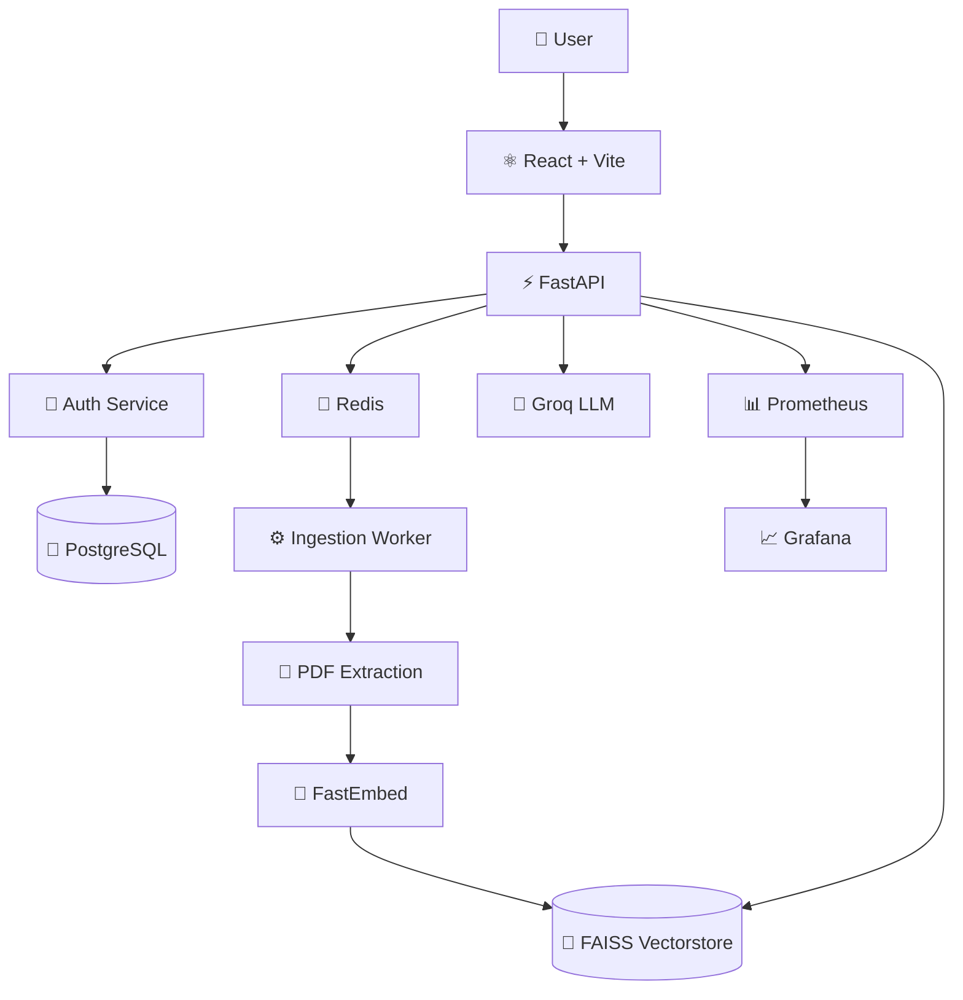

---

title: Medical Chatbot
sdk: docker
app_port: 8000
short_description: AI-powered medical document intelligence with grounded RAG.
------------------------------------------------------------------------------

<div align="center">

# 🩺 Medibot

### Medical intelligence, grounded in your documents.

**Upload medical PDFs. Ask questions. Get answers grounded in the source material.**

<br />

[](https://www.python.org/)
[](https://fastapi.tiangolo.com/)
[](https://react.dev/)
[](https://github.com/facebookresearch/faiss)
[](https://www.docker.com/)
[](https://kubernetes.io/)
[](https://groq.com/)
[](#-license)

<br />

**FastAPI · React · LangChain · FAISS · FastEmbed · Groq · Redis/RQ · PostgreSQL · Docker · Kubernetes · AWS EKS**

</div>

---

## 🎬 See It in Action

> **From document upload to grounded medical answers — in one workflow.**

<div align="center">

### ▶️ [Watch the Medibot Pitch & Demo](pitch.mp4)

</div>

The demo walks through the core experience:

```text
       📄 Upload
          │
          ▼
   ⚙️ Process Document
          │
          ▼
    🧠 Build Embeddings
          │
          ▼
     🔎 FAISS Search
          │
          ▼
   🤖 Grounded Answer
          │
          ▼
    📚 Source Pages
```

---

# 🧠 What is Medibot?

**Medibot** is a full-stack medical document intelligence platform built around **Retrieval-Augmented Generation (RAG)**.

Instead of asking an LLM to answer medical questions purely from its internal knowledge, Medibot allows users to provide their own medical documents and uses those documents as the knowledge source.

The system transforms:

**PDF → text → chunks → embeddings → vector index → retrieval → grounded generation**

This makes the application particularly useful for interacting with:

* Medical textbooks
* Research papers
* Clinical documents
* Guidelines
* Medical notes
* Educational material
* Other domain-specific PDF collections

> **The goal is simple: make medical information easier to search, understand, and explore while keeping the generated response connected to the source material.**

---

# ✨ Why Medibot?

Most chatbot interfaces hide the complexity of document processing behind a simple chat box.

Medibot treats the entire workflow as a system.

### 📄 Your Documents

Build a searchable knowledge base from your own medical PDFs.

### ⚡ Asynchronous Ingestion

Large documents are processed by background workers instead of blocking the API request.

### 🔎 Retrieval Before Generation

The system retrieves relevant document chunks before asking the LLM to formulate an answer.

### 📚 Source-Aware Answers

Retrieved context can be associated with the original document and page information, making the response easier to verify.

### 💬 Conversational Interface

Ask follow-up questions and maintain chat history rather than treating every question as an isolated request.

### 📊 Production Observability

Prometheus and Grafana provide the foundation for monitoring the running system.

### ☸️ Built to Scale

The architecture separates API traffic, ingestion workers, Redis queues, and persistent vector storage.

---

# 🚀 Core Features

<table>
<tr>
<td width="50%">

### 📚 Document RAG

Upload medical PDFs and transform them into a searchable semantic knowledge base.

</td>
<td width="50%">

### 🔍 Semantic Retrieval

FAISS retrieves document chunks that are semantically relevant to the user's question.

</td>
</tr>

<tr>
<td>

### ⚙️ Background Processing

Redis + RQ move expensive PDF ingestion and embedding workloads away from the API request path.

</td>
<td>

### 🤖 Groq-powered Generation

Retrieved context is passed to a Groq-hosted LLM to generate the final response.

</td>
</tr>

<tr>
<td>

### 📖 Source References

Responses can be connected back to relevant document sources and pages.

</td>
<td>

### 💬 Chat History

Authenticated users can retain and continue previous conversations.

</td>
</tr>

<tr>
<td>

### 🔐 Authentication

Email/password authentication with optional Google Sign-In.

</td>
<td>

### 📊 Observability

Prometheus metrics and Grafana dashboards for system monitoring.

</td>
</tr>

<tr>
<td>

### 🐳 Containerized

Docker and Docker Compose support for reproducible environments.

</td>
<td>

### ☁️ Cloud Ready

Deploy to Hugging Face Spaces, Render, Railway, Kubernetes, or AWS EKS.

</td>
</tr>
</table>

---

# 🧬 How Medibot Works

## 01 — Upload

The user uploads a medical PDF through the React interface.

```text
PDF
 │
 ▼
FastAPI
```

The API creates an ingestion job rather than performing the entire operation synchronously.

---

## 02 — Queue

The ingestion job is dispatched through Redis/RQ.

```text
FastAPI
   │
   ▼
Redis Queue
   │
   ▼
Ingestion Worker
```

This prevents expensive document processing from blocking normal chat traffic.

---

## 03 — Extract

The worker extracts text from the uploaded PDF and prepares it for retrieval.

```text
PDF
 │
 ▼
Text Extraction
 │
 ▼
Document Chunks
```

---

## 04 — Embed

Chunks are transformed into vector representations using:

```text
BAAI/bge-small-en-v1.5
```

through FastEmbed.

```text
Document Chunk
      │
      ▼
   FastEmbed
      │
      ▼
Embedding Vector
```

---

## 05 — Index

The embeddings are stored in a FAISS vector index.

```text
Embedding Vectors
       │
       ▼
      FAISS
       │
       ▼
Searchable Knowledge Base
```

---

## 06 — Retrieve

When the user asks a question, the query is embedded and compared against the vector index.

```text
User Question
      │
      ▼
Query Embedding
      │
      ▼
FAISS Similarity Search
      │
      ▼
Relevant Chunks
```

---

## 07 — Generate

The retrieved context is provided to the Groq-powered LLM.

```text
User Question
      +
Retrieved Context
      │
      ▼
   Groq LLM
      │
      ▼
Grounded Response
```

---

## 08 — Respond

The answer is streamed back to the frontend, with source information available for verification.

```text
┌─────────────────────────────────┐
│          AI Response            │
│                                 │
│  Grounded answer generated      │
│  from retrieved medical text.   │
│                                 │
│  Sources:                       │
│  📄 Document — Page X           │
│  📄 Document — Page Y           │
└─────────────────────────────────┘
```

---

# 🏗️ System Architecture



---

# ⚡ The Important Architectural Decision

The ingestion pipeline is intentionally **decoupled from the chat API**.

A naïve implementation might do:

```text
Upload PDF
     │
     ▼
Extract
     │
     ▼
Embed
     │
     ▼
Build FAISS
     │
     ▼
Return response
```

This means a large document can keep an API request busy for a long time.

Medibot instead uses:

```text
                ┌───────────────┐
                │   PDF Upload  │
                └───────┬───────┘
                        │
                        ▼
                ┌───────────────┐
                │  FastAPI API  │
                └───────┬───────┘
                        │
                        ▼
                 ┌────────────┐
                 │   Redis    │
                 │    Queue   │
                 └─────┬──────┘
                       │
                       ▼
               ┌───────────────┐
               │ Ingest Worker │
               └───────┬───────┘
                       │
                       ▼
               ┌───────────────┐
               │ PDF → Embed   │
               │ → FAISS       │
               └───────────────┘
```

This separation allows the API layer and ingestion layer to scale independently.

---

# 🧩 Technology Stack

| Layer           | Technology        | Role                               |
| --------------- | ----------------- | ---------------------------------- |
| Frontend        | React + Vite      | Chat and document UI               |
| API             | FastAPI           | Application API                    |
| RAG             | LangChain         | Retrieval/generation orchestration |
| Vector Search   | FAISS             | Semantic similarity search         |
| Embeddings      | FastEmbed         | Local embedding generation         |
| Embedding Model | BGE-small-en-v1.5 | Document/query embeddings          |
| LLM             | Groq              | Response generation                |
| Queue           | Redis             | Job dispatch                       |
| Workers         | RQ                | Background ingestion               |
| Auth DB         | PostgreSQL        | Production accounts/history        |
| Local Auth      | SQLite            | Development fallback               |
| Containers      | Docker            | Packaging                          |
| Orchestration   | Kubernetes        | Production deployment              |
| Monitoring      | Prometheus        | Metrics                            |
| Dashboards      | Grafana           | Observability                      |
| CI/CD           | GitLab CI/CD      | Build and deployment               |
| Cloud           | AWS EKS           | Kubernetes production environment  |

---

# 📁 Project Structure

```text
medical-chatbot/
│
├── backend/
│   ├── main.py
│   ├── ingest_worker.py
│   ├── job_store.py
│   └── ...
│
├── frontend/
│   ├── src/
│   ├── public/
│   └── ...
│
├── docker/
│   ├── backend.Dockerfile
│   └── frontend.Dockerfile
│
├── k8s/
│   ├── backend/
│   ├── frontend/
│   ├── ingress/
│   ├── hpa/
│   ├── monitoring/
│   └── overlays/
│
├── testing/
│   ├── tests/
│   ├── reports/
│   └── evaluations/
│
├── ops/
│   └── production-guide.md
│
├── docker-compose.yml
├── docker-compose.ports.override.yml
├── Dockerfile
├── render.yaml
├── .gitlab-ci.yml
└── README.md
```

| Directory / File           | Purpose                                    |
| -------------------------- | ------------------------------------------ |
| `backend/`                 | FastAPI, authentication, RAG and ingestion |
| `backend/ingest_worker.py` | Background ingestion worker                |
| `backend/job_store.py`     | Upload job state                           |
| `frontend/`                | React application                          |
| `docker/`                  | Production Dockerfiles                     |
| `k8s/`                     | Kubernetes manifests                       |
| `testing/`                 | Tests and evaluation reports               |
| `ops/`                     | Production documentation                   |
| `docker-compose.yml`       | Complete local stack                       |
| `render.yaml`              | Render deployment configuration            |
| `.gitlab-ci.yml`           | GitLab CI/CD pipeline                      |

---

# ⚡ Quick Start

## Prerequisites

* Python **3.11 or 3.12**
* Node.js
* Docker
* A Groq API key

---

## 1. Clone

```bash
git clone <your-repository-url>
cd medical-chatbot
```

---

## 2. Configure environment

Create:

```text
backend/.env
```

Minimum configuration:

```env
GROQ_API_KEYS=your_groq_api_key
```

Recommended production configuration:

```env
AUTH_SECRET=your_secure_secret
AUTH_DATABASE_URL=postgresql://...
GOOGLE_CLIENT_ID=your_google_client_id
GROQ_API_KEYS=key1,key2
```

> 🔒 Never commit `.env` files or real API keys.

---

## 3. Install backend

Create a virtual environment:

```bash
python -m venv .venv
```

### Windows

```bash
.venv\Scripts\activate
```

### Linux / macOS

```bash
source .venv/bin/activate
```

Install dependencies:

```bash
pip install -r backend/requirements.txt
```

---

## 4. Install frontend

```bash
cd frontend
npm install
npm run build
cd ..
```

---

## 5. Start API

```bash
uvicorn backend.main:app \
  --host 0.0.0.0 \
  --port 8000
```

Open:

```text
Application
http://localhost:8000/

Health
http://localhost:8000/api/health

Metrics
http://localhost:8000/metrics
```

---

# 🐳 Docker

Build:

```bash
docker build -t medical-chatbot .
```

Run:

```bash
docker run \
  --env-file backend/.env \
  -p 8000:8000 \
  medical-chatbot
```

---

# 🐳 Docker Compose

For the complete local product stack:

```bash
docker compose up --build
```

This starts:

```text
                         ┌──────────────┐
                         │   Frontend   │
                         │    :8080     │
                         └──────┬───────┘
                                │
                                ▼
                         ┌──────────────┐
                         │   Gateway    │
                         │    :8000     │
                         └──────┬───────┘
                                │
              ┌─────────────────┼─────────────────┐
              │                 │                 │
              ▼                 ▼                 ▼
          Backend 1         Backend 2         Backend 3
              │                 │                 │
              └─────────────────┼─────────────────┘
                                │
                                ▼
                         ┌──────────────┐
                         │    Redis     │
                         └──────┬───────┘
                                │
                                ▼
                       ┌────────────────┐
                       │ Ingest Worker  │
                       └───────┬────────┘
                               │
                               ▼
                         ┌────────────┐
                         │   FAISS    │
                         └────────────┘
```

### Services

| Service         |     Port | Purpose         |
| --------------- | -------: | --------------- |
| Backend gateway |   `8000` | API             |
| Frontend        |   `8080` | Web application |
| Prometheus      |   `9090` | Metrics         |
| Grafana         |   `3000` | Monitoring      |
| Redis           | Internal | Queue           |
| Ingest worker   | Internal | PDF processing  |

### Grafana

Default local credentials:

```text
username: admin
password: admin
```

Change these before exposing Grafana outside a trusted environment.

---

# 🔀 Alternate Ports

If port `8000` is occupied:

```bash
docker compose \
  -f docker-compose.yml \
  -f docker-compose.ports.override.yml \
  up --build
```

This maps:

```text
Backend   → http://localhost:8010
Frontend  → http://localhost:8081
```

Telemetry ports can be overridden with:

```env
PROMETHEUS_HOST_PORT=
GRAFANA_HOST_PORT=
```

---

# ⚙️ Ingestion Configuration

Recommended local settings:

```env
EMBED_BATCH_SIZE=32
EMBED_THREADS=4
EMBED_PARALLEL=2
INGEST_MAX_WORKERS=8
```

For memory-constrained environments:

```env
EMBED_BATCH_SIZE=4
RAG_MAX_PDF_PAGES=80
```

---

# 🧪 Testing

Tests and generated reports live under:

```text
testing/
```

Run the API tests:

```bash
python -m unittest testing.tests.test_api
```

LLM evaluation reports are generated under:

```text
testing/reports/evaluations/
```

The testing layer provides a foundation for:

* API regression testing
* ingestion verification
* RAG evaluation
* LLM response evaluation
* system verification

---

# 🔌 API

## Health & Observability

| Method | Endpoint      |
| ------ | ------------- |
| `GET`  | `/api/health` |
| `GET`  | `/metrics`    |

## Authentication

| Method | Endpoint             |
| ------ | -------------------- |
| `GET`  | `/api/auth/config`   |
| `POST` | `/api/auth/register` |
| `POST` | `/api/auth/login`    |
| `POST` | `/api/auth/google`   |
| `GET`  | `/api/auth/me`       |

## Chat

| Method | Endpoint            |
| ------ | ------------------- |
| `GET`  | `/api/chat-history` |
| `PUT`  | `/api/chat-history` |
| `POST` | `/api/ask`          |
| `POST` | `/api/ask/stream`   |

## Documents

| Method   | Endpoint                      |
| -------- | ----------------------------- |
| `POST`   | `/api/upload`                 |
| `GET`    | `/api/upload/status/{job_id}` |
| `POST`   | `/api/upload/cancel/{job_id}` |
| `DELETE` | `/api/upload/{job_id}`        |
| `GET`    | `/api/source/{doc_id}`        |

---

# 🔐 Authentication

Medibot supports:

### Local development

Email/password authentication works without an external provider.

If `AUTH_DATABASE_URL` is not configured, the backend falls back to:

```text
backend/data/medibot_auth.sqlite3
```

### Production

Use PostgreSQL:

```env
AUTH_DATABASE_URL=postgresql://...
```

Recommended:

```env
AUTH_SECRET=<strong-random-secret>
AUTH_DATABASE_URL=<postgresql-connection-string>
GOOGLE_CLIENT_ID=<google-client-id>
```

Google Sign-In is enabled when `GOOGLE_CLIENT_ID` is configured.

---

# 🧠 Model Configuration

### Embeddings

Default:

```text
BAAI/bge-small-en-v1.5
```

Configure with:

```env
EMBED_MODEL=BAAI/bge-small-en-v1.5
```

### Groq

Default model:

```env
GROQ_MODEL=llama-3.1-8b-instant
```

Multiple API keys are supported:

```env
GROQ_API_KEYS=key1,key2,key3
```

---

# 📊 Observability

Medibot includes Prometheus and Grafana:

```text
Application
     │
     ▼
 /metrics
     │
     ▼
Prometheus
     │
     ▼
 Grafana
```

This provides visibility into application and infrastructure behavior and creates a foundation for:

* performance monitoring
* ingestion monitoring
* API monitoring
* operational debugging
* capacity planning
* regression detection

---

# ☸️ Kubernetes

The Kubernetes configuration separates:

```text
Frontend
Backend API
Ingestion Worker
Redis
Prometheus
Grafana
Ingress
Autoscaling
```

Apply the base configuration:

```bash
kubectl apply -k k8s
```

---

## Local Kubernetes

Build the backend:

```bash
docker build \
  -f docker/backend.Dockerfile \
  -t medical-chatbot-backend:local .
```

Build the frontend:

```bash
docker build \
  -f docker/frontend.Dockerfile \
  -t medical-chatbot-frontend:local .
```

Deploy:

```bash
kubectl apply -k k8s/overlays/local
```

### Port forwarding

Frontend:

```bash
kubectl -n medical-chatbot \
  port-forward svc/frontend 8080:80
```

Backend:

```bash
kubectl -n medical-chatbot \
  port-forward svc/backend 8000:8000
```

Prometheus:

```bash
kubectl -n medical-chatbot \
  port-forward svc/prometheus 9090:9090
```

Grafana:

```bash
kubectl -n medical-chatbot \
  port-forward svc/grafana 3000:3000
```

---

# ☁️ AWS EKS

The production Kubernetes architecture is designed around AWS EKS.

For shared PDFs and FAISS vectorstores, the `ReadWriteMany` PVCs should use **EFS or another appropriate RWX-compatible storage class**.

```text
                     AWS EKS
                        │
       ┌────────────────┼────────────────┐
       │                │                │
       ▼                ▼                ▼
   Frontend          Backend         Workers
                        │                │
                        ▼                ▼
                      Redis        Shared Storage
                                         │
                                         ▼
                                      FAISS
```

Optional Prometheus Operator resources are available under:

```text
k8s/overlays/operator-monitoring
```

---

# 🔁 GitLab CI/CD

The repository includes a GitLab-first deployment pipeline.

```text
             Git Push
                │
                ▼
        ┌───────────────┐
        │ Test / Compile│
        └───────┬───────┘
                ▼
        ┌───────────────┐
        │ Frontend Build│
        └───────┬───────┘
                ▼
        ┌───────────────┐
        │ Docker Build  │
        └───────┬───────┘
                ▼
        ┌───────────────┐
        │ GitLab Registry│
        └───────┬───────┘
                ▼
        ┌───────────────┐
        │ Manual Deploy │
        └───────┬───────┘
                ▼
              AWS EKS
```

Pipeline responsibilities:

1. Install backend dependencies
2. Run `python -m compileall backend`
3. Install frontend dependencies
4. Run `npm run build`
5. Build backend image
6. Build frontend image
7. Push images to GitLab Container Registry
8. Optionally deploy to EKS

Required variables:

```text
AWS_ACCESS_KEY_ID
AWS_SECRET_ACCESS_KEY
AWS_REGION
EKS_CLUSTER_NAME
GROQ_API_KEYS
```

GitLab provides:

```text
CI_REGISTRY
CI_REGISTRY_USER
CI_REGISTRY_PASSWORD
CI_REGISTRY_IMAGE
```

---

# 🤗 Hugging Face Spaces

Medibot can run as a Docker Space.

### Setup

1. Create a new Hugging Face Space.
2. Select **Docker**.
3. Upload or connect this repository.
4. Add:

```text
GROQ_API_KEYS
```

as a Space secret.

5. Push the repository.
6. Wait for the Docker build.

The application is exposed on:

```text
8000
```

### ⚠️ Free-tier limitation

The free CPU environment uses ephemeral storage.

This means the following may disappear after rebuilds or restarts:

```text
Uploaded PDFs
Embedding caches
FAISS indexes
```

Hugging Face Spaces is therefore best suited for:

**Demos · Prototypes · Experiments · Evaluation**

rather than durable production document storage.

---

# 🚀 Render

The repository includes:

```text
render.yaml
```

and can be deployed as a Docker web service.

### Deployment

1. Push the repository to your Git provider.
2. Create a Render Blueprint.
3. Point it to the repository.
4. Configure:

```text
GROQ_API_KEYS
```

5. Deploy.

Recommended configuration:

```env
DB_FAISS_BASE=/tmp/vectorstore
EMBED_MODEL=BAAI/bge-small-en-v1.5
EMBED_BATCH_SIZE=4
RAG_MAX_PDF_PAGES=80
GROQ_MODEL=llama-3.1-8b-instant
```

Health endpoint:

```text
/api/health
```

### Storage

Free Render instances may spin down when idle and use ephemeral storage.

For persistent vector storage, use a paid plan with a disk:

```env
DB_FAISS_BASE=/data/vectorstore
```

---

# 🚂 Railway

Login:

```bash
npx @railway/cli login
```

Initialize:

```bash
npx @railway/cli init --name Medical_chatbot
```

Link:

```bash
npx @railway/cli service link backend
```

Deploy:

```bash
npx @railway/cli up --service backend
```

Configure:

```text
GROQ_API_KEYS
GROQ_MODEL
DB_FAISS_BASE
EMBED_MODEL
EMBED_BATCH_SIZE
RAG_MAX_PDF_PAGES
```

Recommended:

```env
GROQ_MODEL=llama-3.1-8b-instant
DB_FAISS_BASE=/data/vectorstore
EMBED_MODEL=BAAI/bge-small-en-v1.5
EMBED_BATCH_SIZE=4
RAG_MAX_PDF_PAGES=80
```

Add a persistent volume:

```bash
npx @railway/cli volume add
```

Mount:

```text
/data
```

Then:

```bash
npx @railway/cli variable set \
  --service backend \
  --environment production \
  DB_FAISS_BASE=/data/vectorstore
```

Redeploy:

```bash
npx @railway/cli up --service backend
```

---

# 📦 Deployment Matrix

| Platform          | Best Use            | Persistent Storage | Complexity |
| ----------------- | ------------------- | -----------------: | ---------: |
| 🐳 Docker         | Development         |                  ✅ |        Low |
| 🐳 Docker Compose | Full local stack    |                  ✅ |        Low |
| 🤗 Hugging Face   | Demo                |        ❌ Free tier |        Low |
| 🚀 Render         | Simple deployment   |  ⚠️ Plan dependent |        Low |
| 🚂 Railway        | Small production    |      ✅ With volume |        Low |
| ☸️ Kubernetes     | Production          |                  ✅ |       High |
| ☁️ AWS EKS        | Scalable production |                  ✅ |       High |

---

# ⚙️ Environment Variables

```env
# ─────────────────────────────
# LLM
# ─────────────────────────────

GROQ_API_KEYS=
GROQ_MODEL=llama-3.1-8b-instant


# ─────────────────────────────
# Embeddings
# ─────────────────────────────

EMBED_MODEL=BAAI/bge-small-en-v1.5
EMBED_BATCH_SIZE=4
EMBED_THREADS=4
EMBED_PARALLEL=2


# ─────────────────────────────
# RAG
# ─────────────────────────────

DB_FAISS_BASE=/data/vectorstore
RAG_MAX_PDF_PAGES=80


# ─────────────────────────────
# Ingestion
# ─────────────────────────────

INGEST_MAX_WORKERS=8


# ─────────────────────────────
# Authentication
# ─────────────────────────────

AUTH_SECRET=
AUTH_DATABASE_URL=
GOOGLE_CLIENT_ID=


# ─────────────────────────────
# Observability
# ─────────────────────────────

PROMETHEUS_HOST_PORT=
GRAFANA_HOST_PORT=
```

---

# 🛠️ Troubleshooting

<details>
<summary><strong>❌ Render deployment fails because of large local files</strong></summary>

Make sure generated runtime data is not committed:

```text
backend/data/
vectorstore/
```

Also ensure `.env` files are excluded from the Docker build context.

</details>

<details>
<summary><strong>❌ /app/health returns Not Found</strong></summary>

Use:

```text
/api/health
```

instead.

</details>

<details>
<summary><strong>❌ RAG not ready</strong></summary>

Check that:

1. A PDF has been uploaded.
2. Ingestion has completed.
3. The vectorstore exists.
4. `DB_FAISS_BASE` points to the correct location.

</details>

<details>
<summary><strong>❌ Frontend is blank</strong></summary>

Check that static assets are being served from:

```text
/assets/
```

Then perform a hard refresh.

</details>

<details>
<summary><strong>❌ Railway runs out of memory during ingestion</strong></summary>

Reduce:

```env
EMBED_BATCH_SIZE=4
```

and:

```env
RAG_MAX_PDF_PAGES=80
```

Start with smaller PDFs on memory-constrained instances.

</details>

---

# 🔒 Security

Medical information requires careful treatment.

### Never commit

```text
.env
API keys
Database passwords
Private credentials
Production secrets
```

If a credential is leaked:

1. Revoke it.
2. Rotate it.
3. Update deployment secrets.
4. Review repository history if necessary.

For production environments, consider:

* HTTPS
* strong authentication secrets
* managed PostgreSQL
* secret management
* restricted Kubernetes permissions
* protected monitoring endpoints
* persistent and controlled document storage
* appropriate access controls
* audit logging

---

# ⚠️ Medical Disclaimer

**Medibot is an AI-assisted medical information tool, not a medical professional or clinical decision-making system.**

AI-generated responses can contain errors, omissions, or inappropriate interpretations.

This project should not be used as a substitute for:

* professional medical advice
* diagnosis
* treatment decisions
* emergency medical care
* clinical judgment

Any real-world clinical deployment would require appropriate **clinical validation, privacy controls, security review, human oversight, evaluation, governance, and regulatory compliance**.

---

# 📈 Scaling Philosophy

Medibot is designed around one important principle:

> **Chat traffic and document processing should not compete for the same resources.**

The system therefore separates:

```text
                    MEDIBOT
                       │
          ┌────────────┴────────────┐
          │                         │
          ▼                         ▼
     CHAT PATH                 INGESTION PATH
          │                         │
          ▼                         ▼
      FastAPI                    Redis
          │                         │
          ▼                         ▼
       Groq                    RQ Worker
                                    │
                                    ▼
                             PDF + Embeddings
                                    │
                                    ▼
                                  FAISS
```

This makes it possible to scale API replicas and ingestion workers independently.

---

# 🗺️ Roadmap

Potential future improvements include:

* [ ] Improved document-level access control
* [ ] Multi-document collections
* [ ] Advanced reranking
* [ ] Hybrid lexical + semantic retrieval
* [ ] Better citation verification
* [ ] Streaming retrieval events
* [ ] Document management UI
* [ ] Evaluation dashboards
* [ ] Automated RAG quality benchmarks
* [ ] Persistent object storage
* [ ] Advanced observability
* [ ] Fine-grained user permissions
* [ ] Production-grade secret management

---

# 🤝 Contributing

Contributions, bug reports, evaluation improvements, and architecture suggestions are welcome.

Create a branch:

```bash
git checkout -b feature/my-improvement
```

Run backend tests:

```bash
python -m unittest testing.tests.test_api
```

Build the frontend:

```bash
cd frontend
npm run build
```

Then open a pull request.

---

# 📚 Production Documentation

For the complete production deployment reference:

```text
ops/production-guide.md
```

The production guide covers:

* CI/CD
* Kubernetes
* AWS EKS
* monitoring
* autoscaling
* SLA considerations
* security
* production operations

---

# 📄 License

Medibot is released under the **MIT License**.

See [`LICENSE`](LICENSE) for the complete license text.

```text
MIT License

Copyright (c) 2026 Dinesh

Permission is hereby granted, free of charge, to any person obtaining a copy
of this software and associated documentation files (the "Software"), to deal
in the Software without restriction, including without limitation the rights
to use, copy, modify, merge, publish, distribute, sublicense, and/or sell
copies of the Software, and to permit persons to whom the Software is
furnished
to do so, subject to the following conditions:

The above copyright notice and this permission notice shall be included in all
copies or substantial portions of the Software.

THE SOFTWARE IS PROVIDED "AS IS", WITHOUT WARRANTY OF ANY KIND, EXPRESS OR
IMPLIED, INCLUDING BUT NOT LIMITED TO THE WARRANTIES OF MERCHANTABILITY,
FITNESS FOR A PARTICULAR PURPOSE AND NONINFRINGEMENT. IN NO EVENT SHALL THE
AUTHORS OR COPYRIGHT HOLDERS BE LIABLE FOR ANY CLAIM, DAMAGES OR OTHER
LIABILITY, WHETHER IN AN ACTION OF CONTRACT, TORT OR OTHERWISE, ARISING FROM,
OUT OF OR IN CONNECTION WITH THE SOFTWARE OR THE USE OR OTHER DEALINGS IN THE
SOFTWARE.
```

---

<div align="center">

# 🩺 Medibot

### Upload. Retrieve. Reason. Verify.

**Medical document intelligence powered by RAG.**

<br />

⭐ **If Medibot is useful to you, consider giving the repository a star.**

<br />

Built with **FastAPI · React · FAISS · FastEmbed · Groq · Redis · Kubernetes**

</div>
