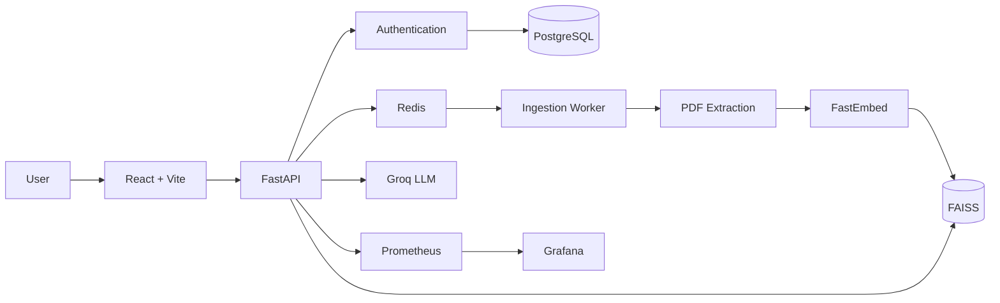

<div align="center">

# 🩺 Medibot AI


### Medical intelligence, grounded in your documents.

**Upload medical PDFs. Ask questions. Get answers grounded in the source material.**

[](https://www.python.org/)
[](https://fastapi.tiangolo.com/)
[](https://react.dev/)
[](https://github.com/facebookresearch/faiss)
[](https://www.docker.com/)
[](https://kubernetes.io/)
[](https://groq.com/)
[](#license)

**FastAPI · React · LangChain · FAISS · FastEmbed · Groq · Redis/RQ · PostgreSQL · Docker · Kubernetes · AWS EKS**

</div>

---

## 🎬 See Medibot in Action

<p align="center">
  
</p>

> The GIF is compressed; see `pitch.mp4` for the clearer video pitch.

---

## 🩺 What is Medibot?

**Medibot** is a full-stack medical document intelligence platform built around **Retrieval-Augmented Generation (RAG)**.

Instead of relying only on an LLM's internal knowledge, Medibot lets users upload their own medical documents and interact with them through a conversational interface.

```text
PDF → Text Extraction → Chunking → Embeddings
    → FAISS → Semantic Retrieval → Groq LLM
    → Grounded Response → Source References
```

### Why Medibot?

-  **Bring your own knowledge** — upload medical PDFs and create a searchable knowledge base.
-  **Retrieval before generation** — relevant document chunks are retrieved before generation.
-  **Source-aware responses** — document and page information can be surfaced with answers.
-  **Asynchronous ingestion** — extraction, embedding, and indexing run through background workers.
-  **Conversational experience** — authenticated users can persist chat history.
-  **Production-oriented architecture** — API, workers, queues, storage, monitoring, containers, and Kubernetes are separated.

---

## 🚀 Features

| Feature | Description |
|---|---|
| Document RAG | Upload medical PDFs and transform them into a semantic knowledge base. |
| Semantic Search | FAISS retrieves relevant chunks using vector similarity. |
| Async Ingestion | Redis/RQ workers process documents outside the API request path. |
| Groq Generation | Retrieved context is passed to a Groq-hosted LLM. |
| Page References | Retrieved sources can be connected to originating documents and pages. |
| Chat History | Authenticated users can persist and continue conversations. |
| Authentication | Email/password authentication with optional Google Sign-In. |
| Observability | Prometheus metrics and Grafana dashboards provide operational visibility. |
| Docker | Run the application locally with Docker or Docker Compose. |
| Kubernetes | Deploy independently scalable API, worker, Redis, frontend, and monitoring services. |

---

## 🏗️ Architecture



The detailed architecture and scaling rationale are in [`docs/architecture.md`](docs/architecture.md).

---

## 📁 Project Structure

```text
medical-chatbot/
├── backend/
├── frontend/
├── docker/
├── k8s/
├── testing/
├── ops/
├── docs/
│   ├── architecture.md
│   ├── rag-pipeline.md
│   ├── development.md
│   ├── api.md
│   ├── configuration.md
│   ├── deployment.md
│   ├── testing.md
│   ├── troubleshooting.md
│   ├── security.md
│   └── contributing.md
├── docker-compose.yml
├── Dockerfile
├── render.yaml
├── .gitlab-ci.yml
└── README.md
```

---

## ⚡ Quick Start

### Prerequisites

- Python **3.11 or 3.12**
- Node.js
- Docker
- Groq API key

### 1. Clone

```bash
git clone <your-repository-url>
cd medical-chatbot
```

### 2. Configure

Create `backend/.env`:

```env
GROQ_API_KEYS=your_groq_api_key
```

For production authentication, see [`docs/configuration.md`](docs/configuration.md).

>  Never commit `.env` files or real credentials.

### 3. Install backend dependencies

```bash
python -m venv .venv
```

**Windows**
```bash
.venv\Scripts\activate
```

**Linux / macOS**
```bash
source .venv/bin/activate
```

```bash
pip install -r backend/requirements.txt
```

### 4. Install frontend dependencies

```bash
cd frontend
npm install
npm run build
cd ..
```

### 5. Start the API

```bash
uvicorn backend.main:app   --host 0.0.0.0   --port 8000
```

| Service | URL |
|---|---|
|  Application | `http://localhost:8000/` |
|  Health | `http://localhost:8000/api/health` |
|  Metrics | `http://localhost:8000/metrics` |

For Docker, environment variables, model settings, and the full local stack, see [`docs/development.md`](docs/development.md).

---

## 🧠 RAG Pipeline

```text
Upload
  ↓
Redis/RQ
  ↓
PDF Extraction
  ↓
Chunking
  ↓
FastEmbed
  ↓
FAISS
  ↓
Semantic Retrieval
  ↓
Groq LLM
  ↓
Grounded Answer + Sources
```

See [`docs/rag-pipeline.md`](docs/rag-pipeline.md) for the complete pipeline.

---

## 📚 Documentation

| Guide | Covers |
|---|---|
| [Architecture](docs/architecture.md) | System architecture, decoupling, and scaling |
| [RAG Pipeline](docs/rag-pipeline.md) | Upload, ingestion, embeddings, retrieval, generation |
| [Development](docs/development.md) | Local setup, Docker, Compose, ports, model/ingestion settings |
| [API Reference](docs/api.md) | Health, authentication, chat, and document endpoints |
| [Configuration](docs/configuration.md) | Environment variables and authentication configuration |
| [Deployment](docs/deployment.md) | Kubernetes, AWS EKS, GitLab CI/CD, HF Spaces, Render, Railway |
| [Testing](docs/testing.md) | Tests and LLM/RAG evaluation |
| [Troubleshooting](docs/troubleshooting.md) | Common deployment and runtime problems |
| [Security](docs/security.md) | Secrets, production security, and medical-data considerations |
| [Contributing](docs/contributing.md) | Development checks and pull requests |
| [Production Guide](ops/production-guide.md) | Detailed production operations guide |

---

## 📦 Deployment Options

| Platform | Best For | Persistent Storage | Complexity |
|---|---|---:|---:|
|  Docker | Development | ✅ | Low |
|  Docker Compose | Full local stack | ✅ | Low |
|  Hugging Face | Demo / prototype | ❌ Free tier | Low |
|  Render | Simple deployment | ⚠️ Plan dependent | Low |
|  Railway | Small production | ✅ With volume | Low |
|  Kubernetes | Production | ✅ | High |
|  AWS EKS | Scalable production | ✅ | High |

Deployment instructions are in [`docs/deployment.md`](docs/deployment.md).

---

## ⚠️ Medical Disclaimer

**Medibot is an AI-assisted medical information tool, not a medical professional or clinical decision-making system.**

AI-generated responses can contain errors, omissions, or inappropriate interpretations. This project should not replace professional medical advice, diagnosis, treatment decisions, emergency medical care, or clinical judgment.

Any real-world clinical deployment would require appropriate clinical validation, privacy controls, security review, human oversight, evaluation, governance, and regulatory compliance.

---

## 📄 License

Medibot is released under the **MIT License**. See [`LICENSE`](LICENSE) for the complete license text.

---

<div align="center">

**Upload. Retrieve. Reason. Verify.**

⭐ If you find Medibot useful, consider giving the repository a star.

</div>
