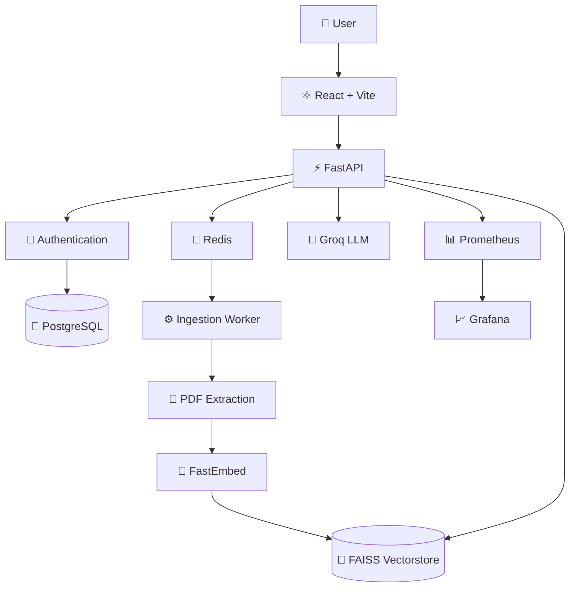

# Architecture



---

## Key Design Decision

The ingestion pipeline is intentionally **decoupled from the chat API**.

A simpler implementation could process everything inside the upload request:

```text
Upload
  │
  ▼
Extract
  │
  ▼
Embed
  │
  ▼
Build FAISS
  │
  ▼
Return
```

This can become problematic when processing large documents.

Medibot instead uses:

```text
                    PDF Upload
                        │
                        ▼
                  ┌───────────┐
                  │  FastAPI  │
                  └─────┬─────┘
                        │
                        ▼
                  ┌───────────┐
                  │   Redis   │
                  │   Queue   │
                  └─────┬─────┘
                        │
                        ▼
                ┌───────────────┐
                │ Ingest Worker │
                └───────┬───────┘
                        │
                        ▼
              PDF → Embed → FAISS
```

This allows the system to scale **chat traffic and document processing independently**.

---

## Scaling Philosophy

Medibot separates **chat traffic** from **document ingestion**.

```text
                    MEDIBOT
                       │
          ┌────────────┴────────────┐
          │                         │
          ▼                         ▼
      CHAT PATH               INGESTION PATH
          │                         │
          ▼                         ▼
       FastAPI                    Redis
          │                         │
          ▼                         ▼
        Groq                  RQ Workers
                                    │
                                    ▼
                           PDF + Embeddings
                                    │
                                    ▼
                                  FAISS
```

This architecture allows:

```text
API replicas        → scale independently
Ingestion workers   → scale independently
Redis               → decouple workloads
Vector storage      → persist knowledge
Monitoring          → observe the system
```

---
